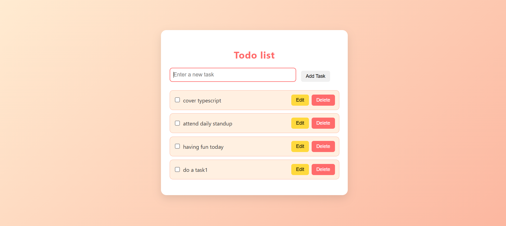
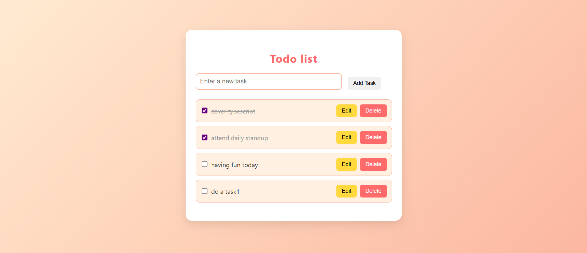
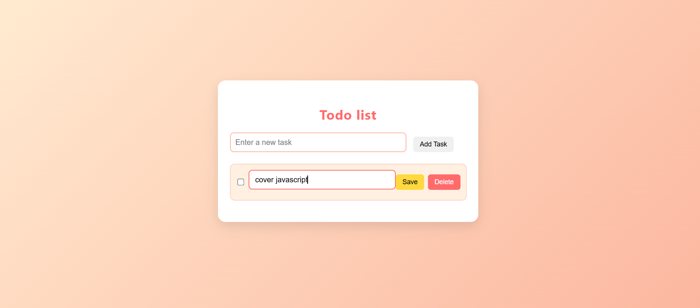
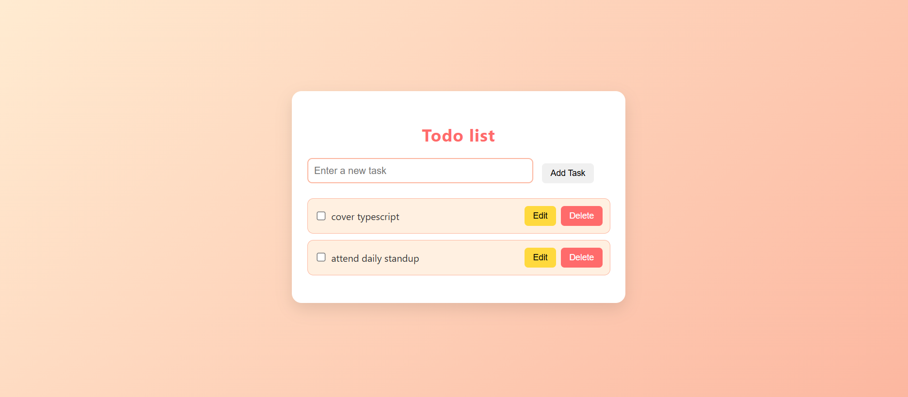

# 📝 Todo List App

This is a simple, user-friendly Todo List web application built with HTML, CSS, and JavaScript. It allows users to:
- Add new tasks
- Mark tasks as completed with a checkbox
- Edit tasks inline
- Delete tasks
- See a message when there are no tasks

The design is clean and modern, perfect for beginner web development projects.

---

## 📸 Screenshots

### 🏠 Home Page (Initial View)


When you first load the app, you’ll see an input field and “Add Task” button, along with a message:  
**“📝 No tasks yet. Add something!”**

---

### ➕ Adding a Task



Type a task in the input field and click the “Add Task” button. The task appears with:
- A checkbox to mark as completed
- An Edit button to modify the task
- A Delete button to remove it

---

### ✅ Mark Task as Completed



Tick the checkbox to strike through the task and mark it as complete.

---

### 📝 Editing a Task



Click the **Edit** button to convert the task into a text box, modify it, then click **Save**.

---

### ❌ Deleting a Task



Click **Delete** to remove the task from the list.  
When all tasks are deleted, the “No tasks yet” message will reappear automatically.

---

## ⚙️ How to Run the Project

1. Clone the repository:
   ```bash
   git clone https://github.com/nebutty/a2sv_web_track.git
   cd todo-list-app
